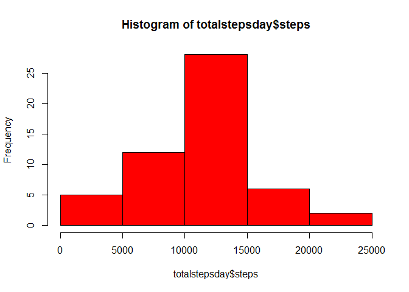
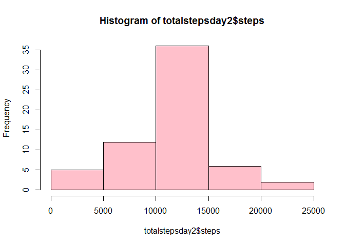

## Loading and preprocessing the data
 
  
1. Loading the data

```r
unzip(zipfile = "activity.zip")
activity <-read.csv("activity.csv")
```


2. Processing/transforming the data into a format suitable for the analysis


```r
str(activity)
```

```
## 'data.frame':	17568 obs. of  3 variables:
##  $ steps   : int  NA NA NA NA NA NA NA NA NA NA ...
##  $ date    : Factor w/ 61 levels "2012-10-01","2012-10-02",..: 1 1 1 1 1 1 1 1 1 1 ...
##  $ interval: int  0 5 10 15 20 25 30 35 40 45 ...
```

```r
head(activity)
```

```
##   steps       date interval
## 1    NA 2012-10-01        0
## 2    NA 2012-10-01        5
## 3    NA 2012-10-01       10
## 4    NA 2012-10-01       15
## 5    NA 2012-10-01       20
## 6    NA 2012-10-01       25
```

```r
activity$date <- as.Date(activity$date)
```


## What is mean total number of steps taken per day?


1. histogram of the total number of steps taken each day
  

```r
totalstepsday <- aggregate(steps ~ date, data = activity, sum)
hist(totalstepsday$steps, col = "red")
```

<!-- -->
  

2. Calculation of the mean and median total number of steps taken per day


```r
c(mean = mean(totalstepsday$steps), median = median(totalstepsday$steps))
```

```
##     mean   median 
## 10766.19 10765.00
```


## What is the average daily activity pattern?


1. time series plot (i.e. type = "l") of the 5-minute interval (x-axis)
and the average number of steps taken, averaged across all days (y-axis)


```r
avgdaily <- aggregate(steps ~ interval, data = activity, mean)
plot(avgdaily, type = "l")
```

<!-- -->


2. Which 5-minute interval, on average across all the days in the dataset,
contains the maximum number of steps?


```r
subset(avgdaily, steps == max(steps))
```

```
##     interval    steps
## 104      835 206.1698
```


## Imputing missing values


1. Calculation of the total number of missing values in the dataset
(i.e. the total number of rows with NAs)


```r
c(number_of_na = sum(is.na(activity)))
```

```
## number_of_na 
##         2304
```


2. Our strategy for filling in all of the missing values in the dataset: 
As suggested, we will use the mean for that day, or the mean for that 5-minute interval.

3. Creating a new dataset that is equal to the original dataset but with the
missing data filled in.


```r
library(dplyr)
```

```
## Warning: package 'dplyr' was built under R version 3.6.3
```

```
## 
## Attaching package: 'dplyr'
```

```
## The following objects are masked from 'package:stats':
## 
##     filter, lag
```

```
## The following objects are masked from 'package:base':
## 
##     intersect, setdiff, setequal, union
```

```r
nafixer <- c()

for (i in activity$interval){
    tmp <- round(mean(filter(activity, interval == i)$steps, na.rm = TRUE),2)
    
    nafixer <- c(nafixer, tmp)
}

steps_clean <- ifelse(is.na(activity$steps), nafixer, activity$steps)
activity_clean <- activity
activity_clean$steps <- steps_clean

head(activity_clean)
```

```
##   steps       date interval
## 1  1.72 2012-10-01        0
## 2  0.34 2012-10-01        5
## 3  0.13 2012-10-01       10
## 4  0.15 2012-10-01       15
## 5  0.08 2012-10-01       20
## 6  2.09 2012-10-01       25
```


4. histogram of the total number of steps taken each day and Calculate
and report the mean and median total number of steps taken per day. 


```r
totalstepsday2 <- aggregate(steps ~ date, data = activity_clean, sum)

hist(totalstepsday2$steps, col = "pink")
```

<!-- -->

```r
c(mean = mean(totalstepsday2$steps), median = median(totalstepsday2$steps))
```

```
##     mean   median 
## 10766.18 10766.13
```

Q: Do these values differ from the estimates from the first part of the assignment?
A: These values are almost the same.

Q: What is the impact of imputing missing data on the estimates of the total
daily number of steps?
A: There is almost no impact on the mean, and a small impact on the median which is slightly higher on the new data set.


## Are there differences in activity patterns between weekdays and weekends?


1. Creating a new factor variable in the dataset with two levels – “weekday”
and “weekend” indicating whether a given date is a weekday or weekend
day.


```r
activity_clean$daytype <- factor(ifelse(weekdays(as.Date(activity_clean$date)) %in% c("samedi", "dimanche"), "weekend", "weekday"))

head(activity_clean)
```

```
##   steps       date interval daytype
## 1  1.72 2012-10-01        0 weekday
## 2  0.34 2012-10-01        5 weekday
## 3  0.13 2012-10-01       10 weekday
## 4  0.15 2012-10-01       15 weekday
## 5  0.08 2012-10-01       20 weekday
## 6  2.09 2012-10-01       25 weekday
```

```r
class(activity_clean$daytype)
```

```
## [1] "factor"
```

```r
str(activity_clean)
```

```
## 'data.frame':	17568 obs. of  4 variables:
##  $ steps   : num  1.72 0.34 0.13 0.15 0.08 2.09 0.53 0.87 0 1.47 ...
##  $ date    : Date, format: "2012-10-01" "2012-10-01" ...
##  $ interval: int  0 5 10 15 20 25 30 35 40 45 ...
##  $ daytype : Factor w/ 2 levels "weekday","weekend": 1 1 1 1 1 1 1 1 1 1 ...
```


2. panel plot containing a time series plot (i.e. type = "l") of the
5-minute interval (x-axis) and the average number of steps taken, averaged
across all weekday days or weekend days (y-axis).


```r
totalstepsday2 <- aggregate(steps ~ date, data = activity_clean, sum)

hist(totalstepsday2$steps, col = "pink")
```

<!-- -->

```r
c(mean = mean(totalstepsday2$steps), median = median(totalstepsday2$steps))
```

```
##     mean   median 
## 10766.18 10766.13
```

Q: Do these values differ from the estimates from the first part of the assignment?
A: These values are almost the same.

Q: What is the impact of imputing missing data on the estimates of the total
daily number of steps?
A: There is almost no impact on the mean, and a small impact on the median which is slightly higher on the new data set.


## Are there differences in activity patterns between weekdays and weekends?


1. Creating a new factor variable in the dataset with two levels – “weekday”
and “weekend” indicating whether a given date is a weekday or weekend
day.


```r
library(lattice)

g <- xyplot(steps ~ interval|daytype, data = activity_clean, layout = c(1,2), type = "l")

print(g)
```

<!-- -->

